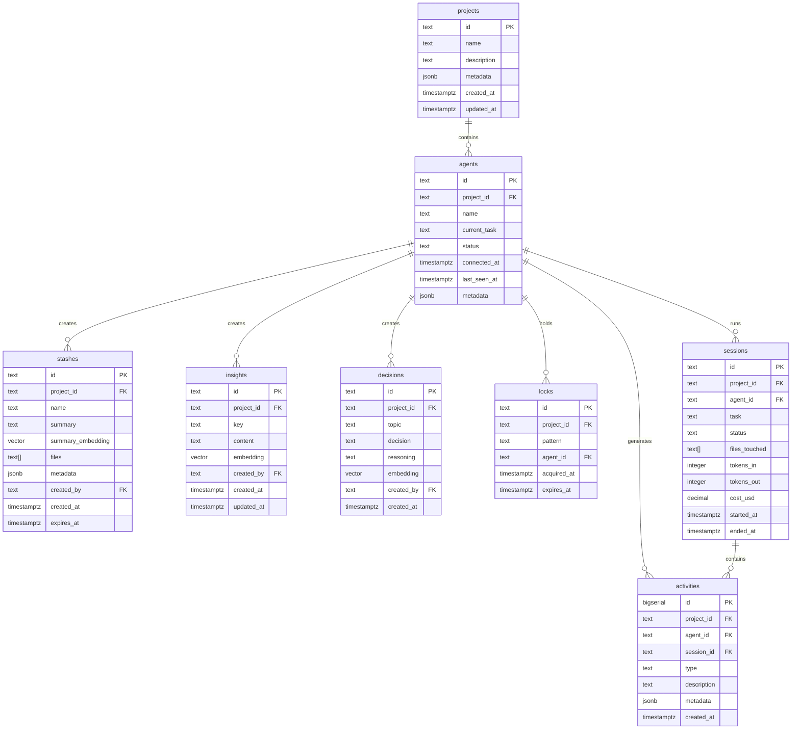

# PopStash Project Plan

**Project Status: EXPERIMENTAL**

## Overview

Memory, coordination (via tasks and locks), observability, and human feedback for your Agents.

AI agents are good enough now. The models aren't the bottleneck.

**Infrastructure is the bottleneck.**

Memory. Coordination. Accountability.

That's PopStash.

### PopStash's Focus

| What PopStash Does | What It Doesn't Do |
|-------------------|-------------------|
| Remembers context across sessions | Call LLMs (agents do that) |
| Prevents agents from colliding | Execute code or write files |
| Tracks what happened and what it cost | Orchestrate workflows |
| Works with Claude Code, Cursor, Cline | Replace your agents |
---

## Quick Start (< 5 Minutes)

Five minutes from now, your AI agents will have memory, coordination, and (some) accountability.

Here's how:

```bash
# 1. Clone and start (30 seconds)
git clone https://github.com/MixTapeSoftware/pop_stash.git
cd pop_stash
docker compose up -d
mix setup

# 2. Create a project (10 seconds)
mix pop_stash.project.new "My Awesome Project"
# => Created project: proj_abc123
# => Add to workspace MCP config:
# => {"url": "http://localhost:4001/mcp/proj_abc123"}

# 3. Add to your workspace MCP config (60 seconds)
# In your project: .claude/mcp_servers.json (commit to git!)
{
  "pop_stash": {
    "url": "http://localhost:4001/mcp/proj_abc123"
  }
}

# 4. Restart Claude Code. That's it.
```

**Why project ID in the URL?**
- Different workspaces/repos use different projects
- Config lives in version control — same for all team members
- Multiple editors on same machine stay isolated automatically

**What just changed:**

| Before | After |
|--------|-------|
| Every session starts from zero | Agent remembers everything |
| Multiple agents = file conflicts | Automatic coordination |
| "What did it do?" 🤷 | Full timeline at localhost:3301 |
| Context dies when window fills | `stash` and `pop` — nothing lost |

**Try it now:** Ask Claude to "start a task on the auth module." Watch it automatically check for conflicts, load relevant context, and acquire locks.

---

### Where we are headed

> "The programming is done by accumulating, massaging and cleaning datasets." — [Andrej Karpathy](https://karpathy.medium.com/software-2-0-a64152b37c35)

PopStash is infrastructure:

- **Decisions are code** — Every `decide` call is like a commit to the project's decision history
- **Context is the program** — Stashes and notes ARE the state that makes agents effective
- **Semantic search over explicit lookup** — `recall` finds relevant context even with fuzzy queries
- **Observable by default** — Every operation emits telemetry; you can always see what happened

### Developer Experience Requirements

These are non-negotiable for project success:

| Requirement | Target |
|-------------|--------|
| **Time to "Hello World"** | < 5 minutes from `git clone` to first `start_task` |
| **Zero configuration** | `docker compose up` and it works |
| **Docs with examples** | Every tool shows input AND expected output |
| **Helpful error messages** | Errors explain what went wrong AND how to fix it |
| **Graceful degradation** | Works with partial setup (DB only, no SigNoz) |

### Fault Tolerance (OTP Philosophy)

> "Let it crash." — Erlang/OTP

- Agent disconnects → locks auto-release, session marked abandoned
- Database unavailable → clear error, no silent failures
- Embedding model slow → operations proceed, embeddings computed async
- SigNoz down → telemetry buffered or dropped, core features unaffected

---

## The Problems We're Solving

### 1. Context Amnesia
Claude Code hits 200k tokens, you start a new session, and it has no idea you spent 3 hours debugging that race condition. All context is lost.

### 2. Session Death
Close your terminal, come back tomorrow — everything's gone. You have to re-explain the entire problem.

### 3. Multi-Agent Chaos
Run three Claude instances on a monorepo and they'll edit the same files, make conflicting decisions, and have no idea what the others are doing.

### 4. Zero Observability
How much did that session cost? What files did it touch? What decisions were made? No idea.

---

## Architecture

```
┌──────────────┐  ┌──────────────┐  ┌──────────────┐
│ Claude Code  │  │    Cursor    │  │    Cline     │
│  (Agent A)   │  │  (Agent B)   │  │  (Agent C)   │
└──────┬───────┘  └──────┬───────┘  └──────┬───────┘
       │                 │                 │
       └─────────────────┼─────────────────┘
                         │ MCP Protocol (stdio)
                         ▼
         ┌───────────────────────────────────┐
         │              PopStash              │
         │                                   │
         │  ┌─────────┐ ┌──────────────────┐ │
         │  │ Memory  │ │   Coordination   │ │
         │  │         │ │                  │ │
         │  │ stash   │ │ acquire/release  │ │
         │  │ pop     │ │ announce         │ │
         │  │ note    │ │ decide           │ │
         │  │ recall  │ │ who_is_working   │ │
         │  └─────────┘ └──────────────────┘ │
         │                                   │
         │  ┌────────────────────────────┐   │
         │  │      Observability         │   │
         │  │                            │   │
         │  │  sessions, costs, timeline │   │
         │  │  OpenTelemetry → SigNoz    │   │
         │  └────────────────────────────┘   │
         │                                   │
         │  ┌────────────────────────────┐   │
         │  │   Nx/Bumblebee Embeddings  │   │
         │  │   (all-MiniLM-L6-v2)       │   │
         │  └────────────────────────────┘   │
         └───────────────────────────────────┘
                         │
                         ▼
                    PostgreSQL
                   (+ pgvector)
```

**No LLM calls.** PopStash is a smart database with MCP tools and local embeddings.

---

## Key Decisions

| Question | Decision |
|----------|----------|
| **Embeddings** | Nx/Bumblebee local (all-MiniLM-L6-v2, 384 dimensions) |
| **Lock expiry** | 15 minutes default, configurable |
| **Multi-project** | Project ID in URL path (`/mcp/:project_id`), workspace-configurable |
| **MCP transport** | stdio for V1 |
| **Stash retention** | Forever by default, optional TTL |
| **Agent IDs** | PopStash assigns them on connect |
| **Telemetry** | OpenTelemetry → SigNoz for distributed tracing |
| **Developer UX** | Pit of success design — make the right thing easy |

---

## Multi-Project Architecture

PopStash supports multiple isolated projects from a single server instance. Each project has its own agents, stashes, insights, decisions, and locks.

### Why Project Isolation?

```
┌─────────────────────────────────────────────────────────────────┐
│                     PopStash Server                              │
│                   (http://localhost:4001)                        │
├─────────────────────────────────────────────────────────────────┤
│                                                                  │
│  ┌─────────────────┐  ┌─────────────────┐  ┌─────────────────┐  │
│  │  Project: foo   │  │  Project: bar   │  │  Project: baz   │  │
│  │  /mcp/proj_foo  │  │  /mcp/proj_bar  │  │  /mcp/proj_baz  │  │
│  │                 │  │                 │  │                 │  │
│  │  • Agents       │  │  • Agents       │  │  • Agents       │  │
│  │  • Stashes      │  │  • Stashes      │  │  • Stashes      │  │
│  │  • Insights     │  │  • Insights     │  │  • Insights     │  │
│  │  • Decisions    │  │  • Decisions    │  │  • Decisions    │  │
│  │  • Locks        │  │  • Locks        │  │  • Locks        │  │
│  └─────────────────┘  └─────────────────┘  └─────────────────┘  │
│                                                                  │
│              Data is completely isolated per project             │
└─────────────────────────────────────────────────────────────────┘
```

### URL-Based Routing

Project ID is embedded in the MCP URL path:

```
POST /mcp/:project_id
```

**Why URL-based?**
- **Explicit**: You always know which project you're operating on
- **Version controllable**: Config lives in workspace `.claude/mcp_servers.json`
- **Team-friendly**: Same config for all team members
- **Stateless**: No session cookies, no hidden state

### Workspace Configuration

Each workspace has its own MCP config (committed to git):

```json
// my-frontend-repo/.claude/mcp_servers.json
{
  "pop_stash": {
    "url": "http://localhost:4001/mcp/proj_frontend_abc123"
  }
}

// my-backend-repo/.claude/mcp_servers.json
{
  "pop_stash": {
    "url": "http://localhost:4001/mcp/proj_backend_xyz789"
  }
}
```

### Multi-Editor Scenario

```
┌──────────────────┐     ┌──────────────────┐
│  Zed Editor #1   │     │  Zed Editor #2   │
│  workspace: foo  │     │  workspace: bar  │
└────────┬─────────┘     └────────┬─────────┘
         │                        │
         │ /mcp/proj_foo          │ /mcp/proj_bar
         │                        │
         ▼                        ▼
┌─────────────────────────────────────────────┐
│              PopStash Server                 │
│                                             │
│  proj_foo: stashes, insights, locks...      │
│  proj_bar: stashes, insights, locks...      │
└─────────────────────────────────────────────┘
```

Both editors can run simultaneously without data collision.

### Creating Projects

Use the Mix task to create new projects:

```bash
# Create a new project
mix pop_stash.project.new "My Project Name"
# => Created project: proj_abc123
# => Add to workspace config:
# => {"url": "http://localhost:4001/mcp/proj_abc123"}

# List all projects
mix pop_stash.project.list
# => proj_abc123  My Project Name       (created 2 days ago)
# => proj_xyz789  Another Project       (created 1 week ago)

# Delete a project (with confirmation)
mix pop_stash.project.delete proj_abc123
# => Are you sure? This will delete all agents, stashes, insights,
# => decisions, and locks for this project. [y/N]
```

### Multiple Projects per Workspace (Advanced)

You can connect multiple projects simultaneously if needed:

```json
// .claude/mcp_servers.json
{
  "pop_stash_frontend": {
    "url": "http://localhost:4001/mcp/proj_frontend"
  },
  "pop_stash_shared": {
    "url": "http://localhost:4001/mcp/proj_shared_libs"
  }
}
```

Tools appear namespaced:
- `pop_stash_frontend/stash`
- `pop_stash_frontend/recall`
- `pop_stash_shared/stash`
- `pop_stash_shared/recall`

This allows cross-project operations when needed.

---

## The Three Pillars

### Pillar 1: Memory

Persistent storage that survives session death.

| Tool | Purpose |
|------|---------|
| `stash` | Save current context with a name ("auth-debugging") |
| `pop` | Restore a stash (by name or semantic search) |
| `insight` | Save a persistent insight ("The auth module uses JWT") |
| `recall` | Search insights semantically ("how does auth work?") |
| `decide` | Record a decision ("Using Guardian for auth tokens") |
| `get_decisions` | Get decisions on a topic |

### Pillar 2: Coordination

Multi-agent awareness and conflict prevention.

| Tool | Purpose |
|------|---------|
| `acquire` | Get exclusive lock on file(s) before editing |
| `release` | Release lock when done |
| `announce` | Broadcast what you're working on ("Refactoring auth module") |
| `decide` | Record a decision for all agents ("Using Guardian for auth") |
| `who_is_working` | See all active agents and what they're doing |
| `get_decisions` | Get recent decisions on a topic |

### Pillar 3: Observability

Visibility into what agents are doing, what it costs, and distributed tracing via **SigNoz**.

| Tool | Purpose |
|------|---------|
| `report_cost` | Agent reports token usage for a task |
| `timeline` | Get recent activity across all agents |
| `session_summary` | Summary of current session (files touched, decisions, cost) |

**Telemetry Stack:**
- **OpenTelemetry** — Instrumentation standard for traces, metrics, and logs
- **SigNoz** — Self-hosted observability platform (APM + logs + traces)
- All storage events are emitted as OpenTelemetry spans for full visibility

---

## Telemetry Architecture

PopStash emits OpenTelemetry spans for all storage operations, enabling full observability in SigNoz.

### Storage Events

All database operations emit telemetry events with the following pattern:

| Event | Span Name | Attributes |
|-------|-----------|------------|
| **Stash created** | `pop_stash.stash.create` | `stash.id`, `stash.name`, `agent.id` |
| **Stash popped** | `pop_stash.stash.pop` | `stash.id`, `stash.name`, `agent.id` |
| **Stash deleted** | `pop_stash.stash.delete` | `stash.id`, `agent.id` |
| **Insight created** | `pop_stash.insight.create` | `insight.id`, `insight.key`, `agent.id` |
| **Insight recalled** | `pop_stash.insight.recall` | `insight.id`, `query`, `agent.id` |
| **Insight updated** | `pop_stash.insight.update` | `insight.id`, `insight.key`, `agent.id` |
| **Insight deleted** | `pop_stash.insight.delete` | `insight.id`, `agent.id` |
| **Decision created** | `pop_stash.decision.create` | `decision.id`, `decision.topic`, `agent.id` |
| **Decision queried** | `pop_stash.decision.query` | `topic`, `count`, `agent.id` |
| **Lock acquired** | `pop_stash.lock.acquire` | `lock.id`, `lock.pattern`, `agent.id` |
| **Lock released** | `pop_stash.lock.release` | `lock.id`, `lock.pattern`, `agent.id` |
| **Lock expired** | `pop_stash.lock.expire` | `lock.id`, `lock.pattern`, `agent.id` |
| **Session started** | `pop_stash.session.start` | `session.id`, `task`, `agent.id` |
| **Session ended** | `pop_stash.session.end` | `session.id`, `status`, `cost_usd`, `agent.id` |
| **Agent connected** | `pop_stash.agent.connect` | `agent.id`, `agent.name` |
| **Agent disconnected** | `pop_stash.agent.disconnect` | `agent.id`, `reason` |
| **Activity logged** | `pop_stash.activity.log` | `activity.type`, `agent.id`, `session.id` |

### Telemetry Module

```elixir
defmodule PopStash.Telemetry do
  @moduledoc """
  OpenTelemetry instrumentation for all PopStash storage operations.
  """
  
  require OpenTelemetry.Tracer, as: Tracer
  
  @doc "Emit a storage event span"
  def emit_storage_event(event_name, attributes, fun) do
    Tracer.with_span event_name, %{attributes: build_attributes(attributes)} do
      try do
        result = fun.()
        Tracer.set_status(:ok, "")
        result
      rescue
        e ->
          Tracer.set_status(:error, Exception.message(e))
          Tracer.record_exception(e, __STACKTRACE__)
          reraise e, __STACKTRACE__
      end
    end
  end
  
  @doc "Emit a simple event (no wrapping)"
  def emit(event_name, attributes) do
    Tracer.add_event(event_name, build_attributes(attributes))
  end
  
  defp build_attributes(attrs) when is_map(attrs) do
    Enum.map(attrs, fn {k, v} -> {to_string(k), v} end)
  end
end
```

### Usage in Storage Modules

```elixir
# Example: PopStash.Memory.create_stash/3
def create_stash(agent_id, name, summary, opts \\ []) do
  PopStash.Telemetry.emit_storage_event(
    "pop_stash.stash.create",
    %{agent_id: agent_id, stash_name: name},
    fn ->
      # ... actual database operation
      %Stash{}
      |> Stash.changeset(%{name: name, summary: summary, created_by: agent_id})
      |> Repo.insert()
    end
  )
end
```

### Ecto Telemetry

Database queries are automatically instrumented via `opentelemetry_ecto`:

```elixir
# In application.ex
:ok = OpentelemetryEcto.setup([:pop_stash, :repo])
```

---

## The Preflight Pattern

Every agent task follows this pattern:

```
┌─────────────────────────────────────────────────────────────┐
│                      START TASK                             │
│                                                             │
│  1. Call start_task("Implement user auth", ["lib/auth.ex"]) │
│  2. PopStash returns:                                        │
│     - Your agent_id                                         │
│     - Lock status (acquired or conflict)                    │
│     - Relevant stashes/notes/decisions                      │
│     - What other agents are doing                           │
│  3. If conflict → STOP, report to user                      │
│  4. Otherwise → proceed with full context                   │
└─────────────────────────────────────────────────────────────┘
                            │
                            ▼
┌─────────────────────────────────────────────────────────────┐
│                      DO THE WORK                            │
│                                                             │
│  - Edit files (you have locks)                              │
│  - Call note() if you learn something important             │
│  - Call decide() if you make an architectural choice        │
│  - Call stash() if context is getting long                  │
└─────────────────────────────────────────────────────────────┘
                            │
                            ▼
┌─────────────────────────────────────────────────────────────┐
│                       END TASK                              │
│                                                             │
│  1. Call end_task("Implemented JWT auth with Guardian")     │
│  2. PopStash:                                                │
│     - Releases your locks                                   │
│     - Logs the activity                                     │
│     - Records cost if provided                              │
└─────────────────────────────────────────────────────────────┘
```

---

## MCP Tools (Complete Specification)

> **Documentation Principle**: Every tool shows realistic input AND expected output.
> Error cases show how to recover. — *José Valim's "docs as feature" philosophy*

### start_task

Called at the beginning of every task. Returns context and acquires locks.

```json
{
  "name": "start_task",
  "description": "Start a new task. Returns context and acquires locks on specified files.",
  "inputSchema": {
    "type": "object",
    "properties": {
      "task": { "type": "string", "description": "What you're about to do" },
      "files": { "type": "array", "items": { "type": "string" }, "description": "Files you'll edit" }
    },
    "required": ["task"]
  }
}
```

**Example — Success:**
```json
// Input
{ "task": "Add JWT authentication to the API", "files": ["lib/auth.ex", "lib/router.ex"] }

// Output
{
  "agent_id": "agent_abc123",
  "session_id": "sess_xyz789",
  "locks": { 
    "acquired": ["lib/auth.ex", "lib/router.ex"], 
    "conflicts": [] 
  },
  "context": {
    "relevant_stashes": [
      { "name": "auth-research", "summary": "Evaluated Guardian vs Pow for auth...", "age": "2 days" }
    ],
    "relevant_insights": [
      { "key": "api-patterns", "content": "All API responses use {:ok, data} | {:error, reason}" }
    ],
    "recent_decisions": [
      { "topic": "auth", "decision": "Use Guardian for JWT tokens", "reasoning": "Better Plug integration" }
    ],
    "other_agents": [
      { "id": "agent_xyz", "task": "Writing tests for user model", "files": ["test/user_test.exs"] }
    ]
  }
}
```

**Example — Conflict:**
```json
// Input
{ "task": "Refactor auth module", "files": ["lib/auth.ex"] }

// Output — STOP and report to user!
{
  "agent_id": "agent_abc123",
  "locks": {
    "acquired": [],
    "conflicts": [
      {
        "file": "lib/auth.ex",
        "held_by": "agent_xyz",
        "task": "Add JWT authentication to the API",
        "held_for": "5 minutes",
        "expires_in": "10 minutes"
      }
    ]
  },
  "suggestion": "Wait for agent_xyz to finish, or ask user to coordinate"
}
```

### end_task

Called at the end of every task. Releases locks and logs activity.

```json
{
  "name": "end_task",
  "description": "End the current task. Releases locks and logs what was accomplished.",
  "inputSchema": {
    "type": "object",
    "properties": {
      "summary": { "type": "string", "description": "What you accomplished" },
      "tokens_in": { "type": "integer" },
      "tokens_out": { "type": "integer" }
    },
    "required": ["summary"]
  }
}
```

**Example:**
```json
// Input
{ 
  "summary": "Added JWT auth with Guardian. Created Auth.Token module, updated router with :api pipeline.", 
  "tokens_in": 15000, 
  "tokens_out": 8000 
}

// Output
{
  "status": "completed",
  "session_id": "sess_xyz789",
  "duration": "12 minutes",
  "locks_released": ["lib/auth.ex", "lib/router.ex"],
  "cost_usd": 0.12
}
```

### stash

Save context for later retrieval. Use when context is getting long or switching tasks.

```json
{
  "name": "stash",
  "description": "Save current context with a name for later retrieval.",
  "inputSchema": {
    "type": "object",
    "properties": {
      "name": { "type": "string", "description": "Short name for this stash" },
      "summary": { "type": "string", "description": "What you were working on and current state" },
      "files": { "type": "array", "items": { "type": "string" } }
    },
    "required": ["name", "summary"]
  }
}
```

**Example:**
```json
// Input
{ 
  "name": "auth-jwt-wip",
  "summary": "Implementing JWT auth. DONE: Auth.Token module, generate/verify functions. TODO: Add to router, write tests. BLOCKER: Need to decide on token expiry time.",
  "files": ["lib/auth/token.ex", "lib/router.ex"]
}

// Output
{
  "stash_id": "stash_abc123",
  "name": "auth-jwt-wip",
  "created_at": "2025-01-15T10:30:00Z",
  "tip": "Use `pop` with name 'auth-jwt-wip' or search 'JWT authentication' to restore"
}
```

### pop

Retrieve a stash by name or semantic search. Works even with fuzzy queries!

```json
{
  "name": "pop",
  "description": "Retrieve a stash by name or semantic search.",
  "inputSchema": {
    "type": "object",
    "properties": {
      "query": { "type": "string", "description": "Name or description to search for" }
    },
    "required": ["query"]
  }
}
```

**Example — By Name:**
```json
// Input
{ "query": "auth-jwt-wip" }

// Output
{
  "stash_id": "stash_abc123",
  "name": "auth-jwt-wip",
  "summary": "Implementing JWT auth. DONE: Auth.Token module, generate/verify functions. TODO: Add to router, write tests. BLOCKER: Need to decide on token expiry time.",
  "files": ["lib/auth/token.ex", "lib/router.ex"],
  "created_at": "2025-01-15T10:30:00Z",
  "created_by": "agent_abc123"
}
```

**Example — Semantic Search:**
```json
// Input (fuzzy query — still works!)
{ "query": "that JWT thing I was working on" }

// Output — finds the right stash via embeddings
{
  "stash_id": "stash_abc123",
  "name": "auth-jwt-wip",
  "summary": "Implementing JWT auth...",
  "match_score": 0.89
}
```

### insight

Save a persistent insight. Insights never expire and are searchable by meaning.

```json
{
  "name": "insight",
  "description": "Save a persistent insight about the codebase.",
  "inputSchema": {
    "type": "object",
    "properties": {
      "key": { "type": "string", "description": "Optional key for direct retrieval" },
      "content": { "type": "string", "description": "The insight content" }
    },
    "required": ["content"]
  }
}
```

**Example:**
```json
// Input
{ 
  "key": "auth-patterns",
  "content": "This codebase uses Guardian for JWT auth. Tokens expire in 24h. Refresh tokens stored in Redis. All auth errors return 401 with {error: 'unauthorized'}."
}

// Output
{
  "insight_id": "insight_xyz789",
  "key": "auth-patterns",
  "created_at": "2025-01-15T10:35:00Z",
  "tip": "Other agents can find this via `recall` with queries like 'how does auth work'"
}
```

### recall

Search insights semantically. Finds relevant info even with vague queries.

```json
{
  "name": "recall",
  "description": "Search insights by semantic similarity.",
  "inputSchema": {
    "type": "object",
    "properties": {
      "query": { "type": "string", "description": "What you want to know about" },
      "limit": { "type": "integer", "default": 5 }
    },
    "required": ["query"]
  }
}
```

**Example:**
```json
// Input (natural language query)
{ "query": "how do we handle authentication in this project", "limit": 3 }

// Output — semantic search finds relevant insights
{
  "results": [
    {
      "insight_id": "insight_xyz789",
      "key": "auth-patterns",
      "content": "This codebase uses Guardian for JWT auth. Tokens expire in 24h...",
      "match_score": 0.92
    },
    {
      "insight_id": "insight_abc456",
      "key": "api-security",
      "content": "All API endpoints require authentication except /health and /metrics...",
      "match_score": 0.78
    }
  ]
}
```

### acquire / release

Manual lock management. Usually you don't need these — `start_task`/`end_task` handle locks automatically.

```json
{
  "name": "acquire",
  "description": "Acquire exclusive lock on files.",
  "inputSchema": {
    "type": "object",
    "properties": {
      "patterns": { "type": "array", "items": { "type": "string" } },
      "ttl_minutes": { "type": "integer", "default": 15 }
    },
    "required": ["patterns"]
  }
}
```

```json
{
  "name": "release",
  "description": "Release locks on files.",
  "inputSchema": {
    "type": "object",
    "properties": {
      "patterns": { "type": "array", "items": { "type": "string" } }
    },
    "required": ["patterns"]
  }
}
```

**When to use manually:** Only when you need locks outside the normal task flow (rare).

### decide

Record an architectural decision. Other agents will see this and can query it.

```json
{
  "name": "decide",
  "description": "Record an architectural decision for all agents.",
  "inputSchema": {
    "type": "object",
    "properties": {
      "topic": { "type": "string", "description": "What area this decision affects" },
      "decision": { "type": "string", "description": "The decision made" },
      "reasoning": { "type": "string", "description": "Why this decision was made" }
    },
    "required": ["topic", "decision"]
  }
}
```

**Example:**
```json
// Input
{
  "topic": "authentication",
  "decision": "Use Guardian library for JWT tokens",
  "reasoning": "Better Plug integration than alternatives. Active maintenance. Team has prior experience."
}

// Output
{
  "decision_id": "dec_abc123",
  "topic": "authentication",
  "created_at": "2025-01-15T10:40:00Z",
  "visibility": "all_agents",
  "tip": "Other agents starting auth-related tasks will see this decision automatically"
}
```

### who_is_working

See all active agents. Useful for understanding what's happening across the project.

```json
{
  "name": "who_is_working",
  "description": "See all active agents and what they're working on.",
  "inputSchema": { "type": "object", "properties": {} }
}
```

**Example:**
```json
// Input
{}

// Output
{
  "active_agents": [
    {
      "agent_id": "agent_abc123",
      "task": "Add JWT authentication to the API",
      "files_locked": ["lib/auth.ex", "lib/router.ex"],
      "started": "12 minutes ago"
    },
    {
      "agent_id": "agent_xyz789",
      "task": "Writing tests for user model",
      "files_locked": ["test/user_test.exs"],
      "started": "5 minutes ago"
    }
  ],
  "idle_agents": [
    { "agent_id": "agent_def456", "last_active": "2 hours ago" }
  ]
}
```

### report_cost

Report token usage for current session. Enables cost tracking and budgeting.

```json
{
  "name": "report_cost",
  "description": "Report token usage for the current session.",
  "inputSchema": {
    "type": "object",
    "properties": {
      "tokens_in": { "type": "integer" },
      "tokens_out": { "type": "integer" },
      "model": { "type": "string", "default": "claude-3-sonnet" }
    },
    "required": ["tokens_in", "tokens_out"]
  }
}
```

**Example:**
```json
// Input
{ "tokens_in": 25000, "tokens_out": 12000, "model": "claude-3-5-sonnet" }

// Output
{
  "session_total": { "tokens_in": 40000, "tokens_out": 20000, "cost_usd": 0.24 },
  "today_total": { "tokens_in": 150000, "tokens_out": 75000, "cost_usd": 0.90 },
  "this_week": { "cost_usd": 4.50 }
}
```

### timeline

Get recent activity across all agents. Great for understanding what happened.

```json
{
  "name": "timeline",
  "description": "Get recent activity across all agents.",
  "inputSchema": {
    "type": "object",
    "properties": {
      "limit": { "type": "integer", "default": 20 },
      "agent_id": { "type": "string", "description": "Filter to specific agent" }
    }
  }
}
```

**Example:**
```json
// Input
{ "limit": 5 }

// Output
{
  "activities": [
    { "time": "2 min ago", "agent": "agent_abc123", "type": "task_ended", "description": "Completed: Add JWT authentication" },
    { "time": "5 min ago", "agent": "agent_xyz789", "type": "decision", "description": "Decided: Use Guardian for JWT" },
    { "time": "14 min ago", "agent": "agent_abc123", "type": "task_started", "description": "Started: Add JWT authentication" },
    { "time": "20 min ago", "agent": "agent_abc123", "type": "stash", "description": "Stashed: auth-research" },
    { "time": "1 hour ago", "agent": "agent_def456", "type": "insight", "description": "Added insight: api-patterns" }
  ]
}
```

---

## PostgreSQL Schema

### Entity Relationship Diagram



### SQL Schema

```sql
-- Enable extensions
CREATE EXTENSION IF NOT EXISTS vector;

-- Projects (top-level isolation boundary)
CREATE TABLE projects (
  id TEXT PRIMARY KEY,  -- e.g., "proj_abc123"
  name TEXT NOT NULL,
  description TEXT,
  metadata JSONB DEFAULT '{}',
  created_at TIMESTAMPTZ DEFAULT now(),
  updated_at TIMESTAMPTZ DEFAULT now()
);

CREATE INDEX projects_name_idx ON projects (name);

-- Agents (connected MCP clients, scoped to project)
CREATE TABLE agents (
  id TEXT PRIMARY KEY,
  project_id TEXT NOT NULL REFERENCES projects(id) ON DELETE CASCADE,
  name TEXT,
  current_task TEXT,
  status TEXT DEFAULT 'active',  -- active, idle, disconnected
  connected_at TIMESTAMPTZ,
  last_seen_at TIMESTAMPTZ,
  metadata JSONB DEFAULT '{}'
);

CREATE INDEX agents_project_idx ON agents (project_id);
CREATE INDEX agents_status_idx ON agents (project_id, status);

-- Stashes (like git stash, scoped to project)
CREATE TABLE stashes (
  id TEXT PRIMARY KEY,
  project_id TEXT NOT NULL REFERENCES projects(id) ON DELETE CASCADE,
  name TEXT NOT NULL,
  summary TEXT NOT NULL,
  summary_embedding vector(384),  -- for semantic search
  files TEXT[],
  metadata JSONB DEFAULT '{}',
  created_by TEXT REFERENCES agents(id),
  created_at TIMESTAMPTZ DEFAULT now(),
  expires_at TIMESTAMPTZ  -- NULL = never expires
);

CREATE INDEX stashes_project_idx ON stashes (project_id);
CREATE INDEX stashes_name_idx ON stashes (project_id, name);
CREATE INDEX stashes_embedding_idx ON stashes USING ivfflat (summary_embedding vector_cosine_ops);

-- Insights (persistent knowledge, scoped to project)
CREATE TABLE insights (
  id TEXT PRIMARY KEY,
  project_id TEXT NOT NULL REFERENCES projects(id) ON DELETE CASCADE,
  key TEXT,
  content TEXT NOT NULL,
  embedding vector(384),  -- for semantic search
  created_by TEXT REFERENCES agents(id),
  created_at TIMESTAMPTZ DEFAULT now(),
  updated_at TIMESTAMPTZ DEFAULT now()
);

CREATE INDEX insights_project_idx ON insights (project_id);
CREATE INDEX insights_key_idx ON insights (project_id, key);
CREATE INDEX insights_embedding_idx ON insights USING ivfflat (embedding vector_cosine_ops);

-- Decisions (shared across agents within a project)
CREATE TABLE decisions (
  id TEXT PRIMARY KEY,
  project_id TEXT NOT NULL REFERENCES projects(id) ON DELETE CASCADE,
  topic TEXT NOT NULL,
  decision TEXT NOT NULL,
  reasoning TEXT,
  embedding vector(384),  -- for semantic search
  created_by TEXT REFERENCES agents(id),
  created_at TIMESTAMPTZ DEFAULT now()
);

CREATE INDEX decisions_project_idx ON decisions (project_id);
CREATE INDEX decisions_topic_idx ON decisions (project_id, topic, created_at DESC);
CREATE INDEX decisions_embedding_idx ON decisions USING ivfflat (embedding vector_cosine_ops);

-- Locks (file coordination, scoped to project)
CREATE TABLE locks (
  id TEXT PRIMARY KEY,
  project_id TEXT NOT NULL REFERENCES projects(id) ON DELETE CASCADE,
  pattern TEXT NOT NULL,  -- file path or glob
  agent_id TEXT REFERENCES agents(id),
  acquired_at TIMESTAMPTZ DEFAULT now(),
  expires_at TIMESTAMPTZ DEFAULT now() + interval '15 minutes'
);

CREATE INDEX locks_project_idx ON locks (project_id);
CREATE INDEX locks_pattern_idx ON locks (project_id, pattern);
CREATE INDEX locks_expires_idx ON locks (expires_at);

-- Sessions (observability, scoped to project)
CREATE TABLE sessions (
  id TEXT PRIMARY KEY,
  project_id TEXT NOT NULL REFERENCES projects(id) ON DELETE CASCADE,
  agent_id TEXT REFERENCES agents(id),
  task TEXT,
  status TEXT DEFAULT 'active',  -- active, completed, abandoned
  files_touched TEXT[],
  tokens_in INTEGER DEFAULT 0,
  tokens_out INTEGER DEFAULT 0,
  cost_usd DECIMAL(10,6) DEFAULT 0,
  started_at TIMESTAMPTZ DEFAULT now(),
  ended_at TIMESTAMPTZ
);

CREATE INDEX sessions_project_idx ON sessions (project_id);
CREATE INDEX sessions_agent_idx ON sessions (project_id, agent_id, started_at DESC);
CREATE INDEX sessions_status_idx ON sessions (project_id, status);

-- Activity log (timeline, scoped to project)
CREATE TABLE activities (
  id BIGSERIAL PRIMARY KEY,
  project_id TEXT NOT NULL REFERENCES projects(id) ON DELETE CASCADE,
  agent_id TEXT REFERENCES agents(id),
  session_id TEXT REFERENCES sessions(id),
  type TEXT NOT NULL,  -- task_started, task_ended, decision, stash, lock_acquired, etc.
  description TEXT,
  metadata JSONB DEFAULT '{}',
  created_at TIMESTAMPTZ DEFAULT now()
);

CREATE INDEX activities_project_idx ON activities (project_id);
CREATE INDEX activities_time_idx ON activities (project_id, created_at DESC);
CREATE INDEX activities_agent_idx ON activities (project_id, agent_id, created_at DESC);
CREATE INDEX activities_type_idx ON activities (project_id, type, created_at DESC);
```

---

## OTP Supervision Tree

```
PopStash.Supervisor (one_for_one)
├── PopStash.Repo (PostgreSQL + pgvector)
├── Phoenix.PubSub (real-time coordination)
│
├── PopStash.Memory.Embeddings (GenServer)
│   └── Loads Nx/Bumblebee model at startup
│
├── Registry (PopStash.Agents.Registry)
│   └── Tracks connected agents by ID
│
├── DynamicSupervisor (PopStash.Agents.Supervisor)
│   ├── PopStash.Agent.Connection (agent_A) ← GenServer per agent
│   ├── PopStash.Agent.Connection (agent_B)
│   └── PopStash.Agent.Connection (agent_C)
│
├── PopStash.Locks.Cleaner (GenServer)
│   └── Periodic cleanup of expired locks
│
└── PopStash.Telemetry
    └── OpenTelemetry span emission for all storage events
```

---

## Core Modules

### PopStash.Memory.Embeddings

```elixir
defmodule PopStash.Memory.Embeddings do
  @moduledoc """
  Local embeddings using Nx/Bumblebee.
  Loads all-MiniLM-L6-v2 at startup for 384-dimensional embeddings.
  """
  use GenServer
  
  def start_link(_opts) do
    GenServer.start_link(__MODULE__, nil, name: __MODULE__)
  end
  
  def embed(text) do
    GenServer.call(__MODULE__, {:embed, text})
  end
  
  @impl true
  def init(_opts) do
    {:ok, model} = Bumblebee.load_model({:hf, "sentence-transformers/all-MiniLM-L6-v2"})
    {:ok, tokenizer} = Bumblebee.load_tokenizer({:hf, "sentence-transformers/all-MiniLM-L6-v2"})
    
    serving = Bumblebee.Text.TextEmbedding.text_embedding(model, tokenizer,
      compile: [batch_size: 1, sequence_length: 512],
      defn_options: [compiler: EXLA]
    )
    
    {:ok, %{serving: serving}}
  end
  
  @impl true
  def handle_call({:embed, text}, _from, %{serving: serving} = state) do
    %{embedding: embedding} = Nx.Serving.run(serving, text)
    {:reply, {:ok, Nx.to_flat_list(embedding)}, state}
  end
end
```

### PopStash.Agent.Connection

```elixir
defmodule PopStash.Agent.Connection do
  @moduledoc """
  GenServer representing a connected agent.
  Handles heartbeat, task tracking, and cleanup on disconnect.
  """
  use GenServer
  
  alias PopStash.{Repo, Coordination, Memory}
  alias PopStash.Coordination.{Agent, Lock, Session}
  
  @heartbeat_interval :timer.seconds(30)
  @heartbeat_timeout :timer.seconds(90)
  
  def start_link(opts) do
    agent_id = Keyword.fetch!(opts, :agent_id)
    GenServer.start_link(__MODULE__, opts, name: via_tuple(agent_id))
  end
  
  def start_task(agent_id, task, files) do
    GenServer.call(via_tuple(agent_id), {:start_task, task, files})
  end
  
  def end_task(agent_id, summary) do
    GenServer.call(via_tuple(agent_id), {:end_task, summary})
  end
  
  def heartbeat(agent_id) do
    GenServer.cast(via_tuple(agent_id), :heartbeat)
  end
  
  @impl true
  def init(opts) do
    agent_id = Keyword.fetch!(opts, :agent_id)
    
    # Create or update agent record
    agent = %Agent{id: agent_id, status: "active", connected_at: DateTime.utc_now()}
    Repo.insert!(agent, on_conflict: :replace_all, conflict_target: :id)
    
    # Schedule heartbeat check
    Process.send_after(self(), :check_heartbeat, @heartbeat_interval)
    
    {:ok, %{
      agent_id: agent_id,
      current_session: nil,
      last_heartbeat: System.monotonic_time(:millisecond)
    }}
  end
  
  @impl true
  def handle_call({:start_task, task, files}, _from, state) do
    # Create session
    session = %Session{
      id: Nanoid.generate(),
      agent_id: state.agent_id,
      task: task,
      files_touched: files,
      started_at: DateTime.utc_now()
    }
    {:ok, session} = Repo.insert(session)
    
    # Acquire locks
    {acquired, conflicts} = Coordination.acquire_locks(state.agent_id, files)
    
    # Get relevant context
    context = %{
      relevant_stashes: Memory.search_stashes(task, limit: 3),
      relevant_insights: Memory.search_insights(task, limit: 5),
      recent_decisions: Coordination.recent_decisions(limit: 5),
      other_agents: Coordination.active_agents(exclude: state.agent_id)
    }
    
    response = %{
      agent_id: state.agent_id,
      session_id: session.id,
      locks: %{acquired: acquired, conflicts: conflicts},
      context: context
    }
    
    {:reply, {:ok, response}, %{state | current_session: session.id}}
  end
  
  @impl true
  def handle_call({:end_task, summary}, _from, state) do
    if state.current_session do
      # Update session
      Repo.get!(Session, state.current_session)
      |> Session.changeset(%{status: "completed", ended_at: DateTime.utc_now()})
      |> Repo.update!()
      
      # Release all locks
      Coordination.release_all_locks(state.agent_id)
      
      # Log activity
      Coordination.log_activity(state.agent_id, state.current_session, "task_ended", summary)
    end
    
    {:reply, :ok, %{state | current_session: nil}}
  end
  
  @impl true
  def handle_cast(:heartbeat, state) do
    {:noreply, %{state | last_heartbeat: System.monotonic_time(:millisecond)}}
  end
  
  @impl true
  def handle_info(:check_heartbeat, state) do
    now = System.monotonic_time(:millisecond)
    if now - state.last_heartbeat > @heartbeat_timeout do
      {:stop, :heartbeat_timeout, state}
    else
      Process.send_after(self(), :check_heartbeat, @heartbeat_interval)
      {:noreply, state}
    end
  end
  
  @impl true
  def terminate(_reason, state) do
    # Mark agent as disconnected
    Repo.get(Agent, state.agent_id)
    |> Agent.changeset(%{status: "disconnected"})
    |> Repo.update()
    
    # Release all locks
    Coordination.release_all_locks(state.agent_id)
  end
  
  defp via_tuple(agent_id) do
    {:via, Registry, {PopStash.Agents.Registry, agent_id}}
  end
end
```

### PopStash.Locks.Cleaner

```elixir
defmodule PopStash.Locks.Cleaner do
  @moduledoc """
  Periodic cleanup of expired locks.
  """
  use GenServer
  
  alias PopStash.Repo
  import Ecto.Query
  
  @cleanup_interval :timer.minutes(1)
  
  def start_link(_opts) do
    GenServer.start_link(__MODULE__, nil, name: __MODULE__)
  end
  
  @impl true
  def init(_opts) do
    schedule_cleanup()
    {:ok, %{}}
  end
  
  @impl true
  def handle_info(:cleanup, state) do
    Repo.delete_all(from l in "locks", where: l.expires_at < ^DateTime.utc_now())
    schedule_cleanup()
    {:noreply, state}
  end
  
  defp schedule_cleanup do
    Process.send_after(self(), :cleanup, @cleanup_interval)
  end
end
```

---

## Project Structure

```
pop_stash/
├── lib/
│   ├── pop_stash.ex                         # Public API facade
│   ├── pop_stash/
│   │   ├── application.ex              # OTP application, supervision tree
│   │   ├── repo.ex                     # Ecto repo
│   │   │
│   │   ├── projects.ex                 # Projects context
│   │   ├── projects/
│   │   │   └── project.ex              # Schema
│   │   │
│   │   ├── memory.ex                   # Memory context (stash, insight, recall)
│   │   ├── memory/
│   │   │   ├── stash.ex                # Schema
│   │   │   ├── insight.ex              # Schema
│   │   │   └── embeddings.ex           # Nx/Bumblebee GenServer
│   │   │
│   │   ├── coordination.ex             # Coordination context
│   │   ├── coordination/
│   │   │   ├── agent.ex                # Schema
│   │   │   ├── lock.ex                 # Schema
│   │   │   ├── decision.ex             # Schema
│   │   │   └── session.ex              # Schema
│   │   │
│   │   ├── agent/
│   │   │   └── connection.ex           # GenServer per connected agent
│   │   │
│   │   ├── observability.ex            # Observability context
│   │   ├── observability/
│   │   │   ├── activity.ex             # Schema
│   │   │   └── cost_tracker.ex         # Token/cost calculations
│   │   │
│   │   ├── locks/
│   │   │   └── cleaner.ex              # Expired lock cleanup
│   │   │
│   │   ├── mcp/
│   │   │   ├── server.ex               # MCP protocol handler
│   │   │   ├── router.ex               # HTTP router with /mcp/:project_id
│   │   │   └── tools.ex                # Tool definitions
│   │   │
│   │   ├── pubsub.ex                   # PubSub wrapper
│   │   ├── release.ex                  # Release-time operations (migrations, etc.)
│   │   ├── telemetry.ex                # OpenTelemetry instrumentation
│   │   └── telemetry/
│   │       ├── storage_handler.ex      # Storage event handlers
│   │       └── ecto_handler.ex         # Ecto query instrumentation
│   │
├── lib/mix/tasks/
│   └── pop_stash/
│       └── project/
│           ├── new.ex                  # mix pop_stash.project.new
│           ├── list.ex                 # mix pop_stash.project.list
│           └── delete.ex               # mix pop_stash.project.delete
│
├── priv/
│   └── repo/
│       └── migrations/
│           ├── 20250101000000_create_projects.exs
│           ├── 20250101000001_create_agents.exs
│           ├── 20250101000002_create_stashes.exs
│           ├── 20250101000003_create_insights.exs
│           ├── 20250101000004_create_decisions.exs
│           ├── 20250101000005_create_locks.exs
│           ├── 20250101000006_create_sessions.exs
│           └── 20250101000007_create_activities.exs
│
├── config/
│   ├── config.exs
│   ├── dev.exs
│   ├── test.exs
│   ├── prod.exs
│   └── runtime.exs
│
├── test/
│   ├── pop_stash/
│   │   ├── projects_test.exs
│   │   ├── memory_test.exs
│   │   ├── coordination_test.exs
│   │   ├── observability_test.exs
│   │   └── mcp/
│   │       └── server_test.exs
│   ├── support/
│   │   └── fixtures.ex
│   └── test_helper.exs
│
├── bin/
│   ├── setup                           # One-time init script
│   ├── server                          # Start server script
│   └── pop_stash                       # CLI wrapper
│
├── docker/
│   └── entrypoint.sh                   # Docker entrypoint
│
├── mix.exs
├── Dockerfile                          # Multi-stage build with ML models
├── docker-compose.yml                  # App + PostgreSQL
└── README.md
```

---

## Configuration

```elixir
# config/config.exs
import Config

config :pop_stash,
  ecto_repos: [PopStash.Repo]

config :pop_stash, PopStash.Repo,
  migration_primary_key: [type: :text]

# config/runtime.exs
import Config

config :pop_stash,
  project_name: System.get_env("DOSSIER_PROJECT_NAME", "default"),
  project_path: System.get_env("DOSSIER_PROJECT_PATH", "."),
  lock_expiry_minutes: System.get_env("DOSSIER_LOCK_EXPIRY", "15") |> String.to_integer()

config :pop_stash, PopStash.Repo,
  url: System.get_env("DATABASE_URL", "postgres://localhost/pop_stash_dev"),
  pool_size: String.to_integer(System.get_env("POOL_SIZE", "10"))

config :nx, default_backend: EXLA.Backend

# OpenTelemetry Configuration
config :opentelemetry,
  span_processor: :batch,
  traces_exporter: :otlp

config :opentelemetry_exporter,
  otlp_protocol: :grpc,
  otlp_endpoint: System.get_env("OTEL_EXPORTER_OTLP_ENDPOINT", "http://localhost:4317")

config :opentelemetry, :resource,
  service: [
    name: "pop_stash",
    namespace: System.get_env("DOSSIER_PROJECT_NAME", "default")
  ]
```

---

## Dependencies

```elixir
# mix.exs
defp deps do
  [
    # Database
    {:ecto_sql, "~> 3.11"},
    {:postgrex, "~> 0.18"},
    {:pgvector, "~> 0.2"},
    
    # Embeddings (local)
    {:nx, "~> 0.7"},
    {:bumblebee, "~> 0.5"},
    {:exla, "~> 0.7"},
    
    # JSON
    {:jason, "~> 1.4"},
    
    # PubSub
    {:phoenix_pubsub, "~> 2.1"},
    
    # IDs
    {:nanoid, "~> 2.1"},
    
    # Telemetry & OpenTelemetry
    {:telemetry, "~> 1.2"},
    {:telemetry_metrics, "~> 1.0"},
    {:opentelemetry, "~> 1.4"},
    {:opentelemetry_api, "~> 1.3"},
    {:opentelemetry_exporter, "~> 1.7"},
    {:opentelemetry_ecto, "~> 1.2"},
    
    # Dev/Test
    {:credo, "~> 1.7", only: [:dev, :test], runtime: false},
    {:dialyxir, "~> 1.4", only: [:dev, :test], runtime: false}
  ]
end
```

---

## Deployment

> **Full deployment documentation:** See [02_deployment.md](./02_deployment.md) for complete Docker and non-Docker setup instructions.

### Quick Start

```bash
# Docker (recommended)
docker compose up -d
# Server runs at http://localhost:4001
# Default project auto-created on first boot

# Without Docker
bin/setup    # One-time: deps, db, migrations, default project
bin/server   # Start server
```

### Docker Compose (Core)

```yaml
# docker-compose.yml
services:
  app:
    build: .
    ports:
      - "4001:4001"
    environment:
      DATABASE_URL: postgres://postgres:postgres@db:5432/pop_stash
      MCP_PORT: 4001
    depends_on:
      db:
        condition: service_healthy

  db:
    image: pgvector/pgvector:pg16
    environment:
      POSTGRES_USER: postgres
      POSTGRES_PASSWORD: postgres
      POSTGRES_DB: pop_stash
    ports:
      - "127.0.0.1:5432:5432"
    volumes:
      - pgdata:/var/lib/postgresql/data
    healthcheck:
      test: ["CMD-SHELL", "pg_isready -U postgres"]
      interval: 5s
      timeout: 5s
      retries: 5

volumes:
  pgdata:
```

### Deployment Files

```
pop_stash/
├── Dockerfile              # Multi-stage build, bundles ML models (~1GB)
├── docker-compose.yml      # App + PostgreSQL
├── docker/
│   └── entrypoint.sh       # Runs setup on first boot, then starts server
└── bin/
    ├── setup               # One-time init (deps, db, migrations, default project)
    ├── server              # Start the server
    └── pop_stash           # CLI wrapper
```

### Key Design Decisions

| Decision | Choice | Rationale |
|----------|--------|-----------|
| **ML Models** | Bundled in Docker image | Larger image but instant startup |
| **Default Project** | Auto-created on first boot | Simpler onboarding |
| **Database** | Configurable via `DATABASE_URL` | Works with external DB |
| **First Run** | Idempotent setup | Safe to run multiple times |

### Environment Variables

| Variable | Default | Description |
|----------|---------|-------------|
| `DATABASE_URL` | `postgres://localhost/pop_stash_dev` | PostgreSQL connection |
| `MCP_PORT` | `4001` | HTTP server port |
| `SECRET_KEY_BASE` | (generated) | Required in production |
| `SKIP_DEFAULT_PROJECT` | `false` | Skip auto-creating default project |

### SigNoz (Optional)

SigNoz observability is optional. See [02_deployment.md](./02_deployment.md) for full SigNoz docker-compose setup with ClickHouse backend.

---

## CLAUDE.md Integration

For agents to actually use PopStash, add to your project's CLAUDE.md:

```markdown
# Coordination Rules (REQUIRED)

This project uses PopStash for multi-agent coordination. You MUST follow these rules:

## At the start of every task:
Call `start_task` with what you're about to do and which files you'll edit.
If there are conflicts, STOP and report to the user.

## At the end of every task:
Call `end_task` with a summary of what you accomplished.

## When making architectural decisions:
Call `decide` to record the decision so other agents know.

## When you learn something important about the codebase:
Call `insight` to save it for future sessions.

## When context is getting long or you're switching tasks:
Call `stash` to save your current state.
```

---

## Build Phases

### Phase 1: MCP Foundation
- [x] Project setup, dependencies, basic config
- [x] **MCP protocol implementation (HTTP transport)**
- [x] **Basic supervision tree (Bandit HTTP server + Router)**
- [x] **Implement `list_tools` and `call_tool` handlers**
- [x] **First tool: `ping` (returns "pong" - validates end-to-end)**
- [x] Manual testing with MCP inspector/Claude Code
- [x] Tests for MCP protocol layer

### Phase 1.5: Projects Foundation
- [x] PostgreSQL setup with pgvector
- [x] Ecto schemas: `projects` table
- [x] **Update router: `/mcp/:project_id` routing**
- [x] **Validate project exists on every request**
- [x] **Mix tasks: `mix pop_stash.project.new`, `list`, `delete`**
- [x] Pass project context to all tool handlers
- [x] Tests for project scoping

### Phase 2: Memory Foundation + Tools

**See [PHASE_2_IMPLEMENTATION_PLAN.md](./PHASE_2_IMPLEMENTATION_PLAN.md) for detailed implementation.**

**Completed:**
- [x] PostgreSQL setup with docker-compose (pgvector extension enabled)
- [x] PopStash.Schema base module (UUID primary keys, UTC timestamps)
- [x] Projects schema, context, migrations, and Mix tasks
- [x] MCP router updated with project validation
- [x] Agents schema, migration, context
- [x] Stashes schema, migration (with project_id + created_by FKs)
- [x] Insights schema, migration (with project_id + created_by FKs)
- [x] Memory context module (stash/insight CRUD)
- [x] MCP tools: `stash`, `pop`, `insight`, `recall` (exact match only)
- [x] Wire tools to server, inject agent context in router
- [x] Tests for agents, memory, and MCP integration
- [x] Manual test with Claude Code


**Technical debt (to be resolved in Phase 5):**
- Agent created per request → Phase 5 (Coordination) adds session management
- No agent cleanup → Phase 5 (Coordination) adds lifecycle management via Agent.Connection GenServer

### Phase 3: Decisions (CURRENT PRIORITY)

**Goal:** Add an immutable decision log so agents can record and query architectural decisions, technical choices, and project direction.

**Why Decisions Are Memory, Not Coordination:**
Decisions are fundamentally about persistent knowledge - "We chose Guardian over Pow for auth because..." The fact that multiple agents can see them is a side effect, not the primary purpose. A single agent working across multiple sessions needs to remember what decisions were made and why.

**Design Decisions:**
- **Immutable log**: Decisions are append-only. New decisions on the same topic create new entries (full history preserved). No updates.
- **Topic normalization**: Topics are lowercased and trimmed to prevent duplicates like "Authentication" vs "authentication"
- **Simplified schema**: Use `topic`, `decision`, `reasoning` (aligned with existing SQL schema in this doc)
- **Defer embeddings**: Column added in Phase 4 when search infrastructure exists
- **Defer semantic search**: Phase 3 uses exact topic matching; Phase 4 adds semantic search

**Schema & Migration:**
- ✅ Create `PopStash.Memory.Decision` schema at `lib/pop_stash/memory/decision.ex`
  - `topic` - What area this decision affects (normalized: lowercase, trimmed)
  - `decision` - What was decided
  - `reasoning` - Why this decision was made (optional)
  - `metadata` (JSONB) - Extensible storage
  - `project_id` - FK to projects
  - `created_by` - FK to agents
- ✅ Add migration for decisions table with indexes on (project_id), (project_id, topic), (project_id, inserted_at)

**Context Functions (add to `PopStash.Memory`):**
- ✅ `create_decision(project_id, agent_id, topic, decision, opts \\ [])` - Create a decision (normalizes topic)
- ✅ `get_decision(decision_id)` - Get by ID
- ✅ `get_decisions_by_topic(project_id, topic)` - Get all decisions for a topic (most recent first)
- ✅ `list_decisions(project_id, opts \\ [])` - List with filters (limit, since datetime)
- ✅ `delete_decision(decision_id)` - Remove decision (admin use only)

**MCP Tools:**
- ✅ Add `decide` tool - Record a decision (topic, decision, reasoning)
- ✅ Add `get_decisions` tool - Query by exact topic or list recent
- ✅ Wire tools to MCP server

**Testing:**
- ✅ Unit tests for Decision schema and context functions
- ✅ Integration tests for MCP tools
- ✅ Test topic normalization (case insensitive matching)
- ✅ Manual test with Claude Code in real workflow

---

### Phase 4: Discoverability with Embeddings & Search

**Goal:** Make PopStash immediately useful by ensuring agents can reliably save and find insights/stashes using semantic search.

**Current State Analysis:**
- ✅ pgvector extension already enabled in database (created in projects migration)
- ✅ Database schemas exist for Stashes, Insights, Decisions
- ❌ NO embedding columns exist yet (need migrations)
- ❌ NO embedding generation infrastructure
- ❌ NO semantic search capability
- ✅ Exact match retrieval works (`get_stash_by_name`, `get_insight_by_key`, `get_decisions_by_topic`)

**Architecture Decision: Local Embeddings Only (No Typesense)**

For this phase, we're implementing semantic search using **local Nx/Bumblebee embeddings + pgvector** only. Typesense is deferred.

**Rationale:**
1. **Simplicity**: Fewer moving parts, less operational complexity
2. **Privacy**: All embeddings computed locally, no external API calls
3. **Cost**: Zero per-embedding cost
4. **pgvector is sufficient**: For PopStash's scale (hundreds to low thousands of documents), pgvector with IVFFlat indexing performs well
5. **Defer Typesense**: Can add hybrid search (keyword + semantic) later if needed

---

## Phase 4 Implementation Plan

### Step 1: Add Embedding Infrastructure

**1.1 Add Dependencies**

Add to `mix.exs`:
```elixir
{:nx, "~> 0.7"},
{:bumblebee, "~> 0.5"},
{:exla, "~> 0.7"}
```

**1.2 Configure Nx to use EXLA**

Add to `config/config.exs`:
```elixir
config :nx, default_backend: EXLA.Backend
```

**1.3 Create Embeddings GenServer**

Create `lib/pop_stash/memory/embeddings.ex`:

```elixir
defmodule PopStash.Memory.Embeddings do
  @moduledoc """
  Local embeddings using Nx/Bumblebee.
  Loads sentence-transformers/all-MiniLM-L6-v2 at startup for 384-dimensional embeddings.
  
  This model is lightweight (~80MB) and fast, with good performance for semantic similarity.
  """
  use GenServer
  require Logger
  
  @model_repo "sentence-transformers/all-MiniLM-L6-v2"
  @embedding_dimension 384
  
  def start_link(_opts) do
    GenServer.start_link(__MODULE__, nil, name: __MODULE__)
  end
  
  @doc """
  Generate embedding vector for the given text.
  Returns {:ok, vector} where vector is a list of 384 floats.
  """
  def embed(text) when is_binary(text) do
    GenServer.call(__MODULE__, {:embed, text}, 30_000)
  end
  
  @doc "Get the embedding dimension (384 for all-MiniLM-L6-v2)"
  def dimension, do: @embedding_dimension
  
  @impl true
  def init(_opts) do
    Logger.info("Loading embedding model: #{@model_repo}")
    
    # Load model and tokenizer
    {:ok, model_info} = Bumblebee.load_model({:hf, @model_repo})
    {:ok, tokenizer} = Bumblebee.load_tokenizer({:hf, @model_repo})
    
    # Create serving for text embedding
    serving = Bumblebee.Text.TextEmbedding.text_embedding(
      model_info, 
      tokenizer,
      compile: [batch_size: 1, sequence_length: 512],
      defn_options: [compiler: EXLA]
    )
    
    Logger.info("Embedding model loaded successfully")
    
    {:ok, %{serving: serving}}
  end
  
  @impl true
  def handle_call({:embed, text}, _from, %{serving: serving} = state) do
    # Truncate very long text (avoid tokenizer issues)
    text = String.slice(text, 0, 5000)
    
    # Generate embedding
    %{embedding: embedding} = Nx.Serving.run(serving, text)
    
    # Convert to list of floats for pgvector
    vector = Nx.to_flat_list(embedding)
    
    {:reply, {:ok, vector}, state}
  rescue
    e ->
      Logger.error("Embedding generation failed: #{Exception.message(e)}")
      {:reply, {:error, :embedding_failed}, state}
  end
end
```

**1.4 Add to Supervision Tree**

Update `lib/pop_stash/application.ex`:

```elixir
def start(_type, _args) do
  children = [
    PopStash.Repo,
    {Bandit, plug: PopStash.MCP.Router, port: port},
    PopStash.Memory.Embeddings  # Add this line
  ]
  
  opts = [strategy: :one_for_one, name: PopStash.Supervisor]
  Supervisor.start_link(children, opts)
end
```

**Testing Step 1:**
```bash
mix deps.get
mix compile
iex -S mix

# In IEx:
{:ok, vec} = PopStash.Memory.Embeddings.embed("How does authentication work?")
length(vec)  # Should be 384
```

---

### Step 2: Add Embedding Columns to Database

**2.1 Create Migration for Stashes**

Create `priv/repo/migrations/YYYYMMDDHHMMSS_add_embedding_to_stashes.exs`:

```elixir
defmodule PopStash.Repo.Migrations.AddEmbeddingToStashes do
  use Ecto.Migration
  
  def change do
    alter table(:stashes) do
      add :embedding, :vector, size: 384
    end
    
    # Create index for vector similarity search
    execute(
      "CREATE INDEX stashes_embedding_idx ON stashes USING ivfflat (embedding vector_cosine_ops) WITH (lists = 100)",
      "DROP INDEX stashes_embedding_idx"
    )
  end
end
```

**2.2 Create Migration for Insights**

Create `priv/repo/migrations/YYYYMMDDHHMMSS_add_embedding_to_insights.exs`:

```elixir
defmodule PopStash.Repo.Migrations.AddEmbeddingToInsights do
  use Ecto.Migration
  
  def change do
    alter table(:insights) do
      add :embedding, :vector, size: 384
    end
    
    execute(
      "CREATE INDEX insights_embedding_idx ON insights USING ivfflat (embedding vector_cosine_ops) WITH (lists = 100)",
      "DROP INDEX insights_embedding_idx"
    )
  end
end
```

**2.3 Create Migration for Decisions**

Create `priv/repo/migrations/YYYYMMDDHHMMSS_add_embedding_to_decisions.exs`:

```elixir
defmodule PopStash.Repo.Migrations.AddEmbeddingToDecisions do
  use Ecto.Migration
  
  def change do
    alter table(:decisions) do
      add :embedding, :vector, size: 384
    end
    
    execute(
      "CREATE INDEX decisions_embedding_idx ON decisions USING ivfflat (embedding vector_cosine_ops) WITH (lists = 100)",
      "DROP INDEX decisions_embedding_idx"
    )
  end
end
```

**Run migrations:**
```bash
mix ecto.migrate
```

**2.4 Update Schemas**

Update `lib/pop_stash/memory/stash.ex`:
```elixir
schema "stashes" do
  # ... existing fields ...
  field :embedding, Pgvector.Ecto.Vector
  
  # ... rest of schema ...
end
```

Update `lib/pop_stash/memory/insight.ex`:
```elixir
schema "insights" do
  # ... existing fields ...
  field :embedding, Pgvector.Ecto.Vector
  
  # ... rest of schema ...
end
```

Update `lib/pop_stash/memory/decision.ex`:
```elixir
schema "decisions" do
  # ... existing fields ...
  field :embedding, Pgvector.Ecto.Vector
  
  # ... rest of schema ...
end
```

**Testing Step 2:**
```bash
mix ecto.migrate
psql -U postgres -d pop_stash_dev -c "\d stashes"
# Should show embedding column with type vector(384)
```

---

### Step 3: Generate Embeddings on Create/Update

**3.1 Update Memory Context for Stashes**

Modify `PopStash.Memory.create_stash/5`:

```elixir
def create_stash(project_id, agent_id, name, summary, opts \\ []) do
  files = Keyword.get(opts, :files, [])
  metadata = Keyword.get(opts, :metadata, %{})
  expires_at = Keyword.get(opts, :expires_at)
  
  # Generate embedding for summary
  embedding_text = summary
  {:ok, embedding} = PopStash.Memory.Embeddings.embed(embedding_text)
  
  attrs = %{
    project_id: project_id,
    created_by: agent_id,
    name: name,
    summary: summary,
    embedding: embedding,  # Add this
    files: files,
    metadata: metadata,
    expires_at: expires_at
  }
  
  %Stash{}
  |> Stash.changeset(attrs)
  |> Repo.insert()
end
```

**3.2 Update Memory Context for Insights**

Modify `PopStash.Memory.create_insight/4`:

```elixir
def create_insight(project_id, agent_id, content, opts \\ []) do
  key = Keyword.get(opts, :key)
  metadata = Keyword.get(opts, :metadata, %{})
  
  # Generate embedding for content
  {:ok, embedding} = PopStash.Memory.Embeddings.embed(content)
  
  attrs = %{
    project_id: project_id,
    created_by: agent_id,
    key: key,
    content: content,
    embedding: embedding,  # Add this
    metadata: metadata
  }
  
  %Insight{}
  |> Insight.changeset(attrs)
  |> Repo.insert()
end
```

Modify `PopStash.Memory.update_insight/2`:

```elixir
def update_insight(insight_id, content) do
  case Repo.get(Insight, insight_id) do
    nil ->
      {:error, :not_found}
    
    insight ->
      # Regenerate embedding when content changes
      {:ok, embedding} = PopStash.Memory.Embeddings.embed(content)
      
      insight
      |> Insight.changeset(%{content: content, embedding: embedding})
      |> Repo.update()
  end
end
```

**3.3 Update Memory Context for Decisions**

Modify `PopStash.Memory.create_decision/5`:

```elixir
def create_decision(project_id, agent_id, topic, decision, opts \\ []) do
  reasoning = Keyword.get(opts, :reasoning)
  metadata = Keyword.get(opts, :metadata, %{})
  
  normalized_topic = Decision.normalize_topic(topic)
  
  # Generate embedding from topic + decision + reasoning
  embedding_text = [topic, decision, reasoning]
    |> Enum.reject(&is_nil/1)
    |> Enum.join(" ")
  
  {:ok, embedding} = PopStash.Memory.Embeddings.embed(embedding_text)
  
  attrs = %{
    project_id: project_id,
    created_by: agent_id,
    topic: normalized_topic,
    decision: decision,
    reasoning: reasoning,
    embedding: embedding,  # Add this
    metadata: metadata
  }
  
  %Decision{}
  |> Decision.changeset(attrs)
  |> Repo.insert()
end
```

**Testing Step 3:**
```elixir
# In IEx:
alias PopStash.Memory
alias PopStash.Repo

# Create test records
{:ok, project} = PopStash.Projects.create_project("test", "Test Project")
{:ok, agent} = PopStash.Agents.get_or_create_agent(project.id, "test-agent")

{:ok, stash} = Memory.create_stash(project.id, agent.id, "test-stash", "Testing embeddings for stashes")
{:ok, insight} = Memory.create_insight(project.id, agent.id, "Embeddings are working!", key: "test")
{:ok, decision} = Memory.create_decision(project.id, agent.id, "testing", "Use Nx for embeddings")

# Verify embeddings were generated
Repo.reload!(stash).embedding |> is_list()  # Should be true
Repo.reload!(insight).embedding |> is_list()  # Should be true
Repo.reload!(decision).embedding |> is_list()  # Should be true
```

---

### Step 4: Implement Semantic Search

**4.1 Add Search Functions to Memory Context**

Add to `lib/pop_stash/memory.ex`:

```elixir
@doc """
Search stashes by semantic similarity.
Returns stashes ordered by relevance (cosine similarity).

## Options
- `:limit` - Maximum number of results (default: 5)
- `:threshold` - Minimum similarity score 0.0-1.0 (default: 0.0)

## Examples

    iex> search_stashes(project_id, "authentication work in progress")
    {:ok, [%Stash{name: "auth-jwt-wip", ...}, ...]}
"""
def search_stashes(project_id, query, opts \\ []) do
  limit = Keyword.get(opts, :limit, 5)
  threshold = Keyword.get(opts, :threshold, 0.0)
  
  # Generate embedding for query
  {:ok, query_embedding} = PopStash.Memory.Embeddings.embed(query)
  
  # Vector similarity search using pgvector
  results =
    from(s in Stash,
      where: s.project_id == ^project_id,
      where: is_nil(s.expires_at) or s.expires_at > ^DateTime.utc_now(),
      order_by: fragment("embedding <=> ?", ^query_embedding),
      limit: ^limit
    )
    |> Repo.all()
    |> Enum.map(fn stash ->
      # Calculate similarity score (1 - cosine_distance)
      distance = cosine_distance(stash.embedding, query_embedding)
      similarity = 1.0 - distance
      
      %{stash: stash, similarity: similarity}
    end)
    |> Enum.filter(fn %{similarity: sim} -> sim >= threshold end)
  
  {:ok, results}
end

@doc """
Search insights by semantic similarity.
Returns insights ordered by relevance.

## Options
- `:limit` - Maximum number of results (default: 5)
- `:threshold` - Minimum similarity score 0.0-1.0 (default: 0.0)

## Examples

    iex> search_insights(project_id, "how does authentication work")
    {:ok, [%{insight: %Insight{...}, similarity: 0.89}, ...]}
"""
def search_insights(project_id, query, opts \\ []) do
  limit = Keyword.get(opts, :limit, 5)
  threshold = Keyword.get(opts, :threshold, 0.0)
  
  {:ok, query_embedding} = PopStash.Memory.Embeddings.embed(query)
  
  results =
    from(i in Insight,
      where: i.project_id == ^project_id,
      order_by: fragment("embedding <=> ?", ^query_embedding),
      limit: ^limit
    )
    |> Repo.all()
    |> Enum.map(fn insight ->
      distance = cosine_distance(insight.embedding, query_embedding)
      similarity = 1.0 - distance
      
      %{insight: insight, similarity: similarity}
    end)
    |> Enum.filter(fn %{similarity: sim} -> sim >= threshold end)
  
  {:ok, results}
end

@doc """
Search decisions by semantic similarity.
Returns decisions ordered by relevance.

## Options
- `:limit` - Maximum number of results (default: 5)
- `:threshold` - Minimum similarity score 0.0-1.0 (default: 0.0)

## Examples

    iex> search_decisions(project_id, "what auth library should we use")
    {:ok, [%{decision: %Decision{...}, similarity: 0.92}, ...]}
"""
def search_decisions(project_id, query, opts \\ []) do
  limit = Keyword.get(opts, :limit, 5)
  threshold = Keyword.get(opts, :threshold, 0.0)
  
  {:ok, query_embedding} = PopStash.Memory.Embeddings.embed(query)
  
  results =
    from(d in Decision,
      where: d.project_id == ^project_id,
      order_by: fragment("embedding <=> ?", ^query_embedding),
      limit: ^limit
    )
    |> Repo.all()
    |> Enum.map(fn decision ->
      distance = cosine_distance(decision.embedding, query_embedding)
      similarity = 1.0 - distance
      
      %{decision: decision, similarity: similarity}
    end)
    |> Enum.filter(fn %{similarity: sim} -> sim >= threshold end)
  
  {:ok, results}
end

# Helper function for cosine distance calculation
defp cosine_distance(vec1, vec2) when is_list(vec1) and is_list(vec2) do
  # pgvector stores vectors, convert to lists if needed
  vec1 = if is_struct(vec1), do: Pgvector.to_list(vec1), else: vec1
  vec2 = if is_struct(vec2), do: Pgvector.to_list(vec2), else: vec2
  
  # Compute dot product and magnitudes
  dot_product = Enum.zip(vec1, vec2) |> Enum.map(fn {a, b} -> a * b end) |> Enum.sum()
  mag1 = :math.sqrt(Enum.map(vec1, &(&1 * &1)) |> Enum.sum())
  mag2 = :math.sqrt(Enum.map(vec2, &(&2 * &2)) |> Enum.sum())
  
  # Cosine distance = 1 - cosine_similarity
  1.0 - (dot_product / (mag1 * mag2))
end
```

**Note:** pgvector's `<=>` operator computes cosine distance directly in SQL, so we don't need to calculate it for ordering. The `cosine_distance/2` helper is only for computing the similarity score to show to users.

**4.2 Update MCP Tools to Use Semantic Search**

**Update `pop` tool** (`lib/pop_stash/mcp/tools/pop.ex`):

```elixir
def execute(%{"query" => query}, %{project_id: project_id}) do
  # Try exact match first (fast path)
  case Memory.get_stash_by_name(project_id, query) do
    {:ok, stash} ->
      format_stash_response(stash, 1.0)
    
    {:error, :not_found} ->
      # Fall back to semantic search
      case Memory.search_stashes(project_id, query, limit: 1, threshold: 0.3) do
        {:ok, [%{stash: stash, similarity: sim} | _]} ->
          format_stash_response(stash, sim)
        
        {:ok, []} ->
          {:error, "No stash found matching '#{query}'"}
        
        {:error, reason} ->
          {:error, "Search failed: #{inspect(reason)}"}
      end
  end
end

defp format_stash_response(stash, similarity) do
  {:ok, %{
    stash_id: stash.id,
    name: stash.name,
    summary: stash.summary,
    files: stash.files,
    created_at: stash.inserted_at,
    created_by: stash.created_by,
    match_score: Float.round(similarity, 2)
  }}
end
```

**Update `recall` tool** (`lib/pop_stash/mcp/tools/recall.ex`):

```elixir
def execute(%{"query" => query} = args, %{project_id: project_id}) do
  limit = Map.get(args, "limit", 5)
  
  # Try exact key match first (fast path)
  exact_match = Memory.get_insight_by_key(project_id, query)
  
  case exact_match do
    {:ok, insight} ->
      # Found by exact key, return it
      {:ok, %{
        results: [format_insight(insight, 1.0)]
      }}
    
    {:error, :not_found} ->
      # Fall back to semantic search
      case Memory.search_insights(project_id, query, limit: limit, threshold: 0.3) do
        {:ok, results} ->
          {:ok, %{
            results: Enum.map(results, fn %{insight: i, similarity: s} -> 
              format_insight(i, s) 
            end)
          }}
        
        {:error, reason} ->
          {:error, "Search failed: #{inspect(reason)}"}
      end
  end
end

defp format_insight(insight, similarity) do
  %{
    insight_id: insight.id,
    key: insight.key,
    content: insight.content,
    match_score: Float.round(similarity, 2),
    created_at: insight.inserted_at,
    updated_at: insight.updated_at
  }
end
```

**Create new `search_decisions` tool** (`lib/pop_stash/mcp/tools/search_decisions.ex`):

```elixir
defmodule PopStash.MCP.Tools.SearchDecisions do
  @moduledoc """
  MCP tool for semantic search over decisions.
  """
  
  @behaviour PopStash.MCP.ToolBehaviour
  
  alias PopStash.Memory
  
  @impl true
  def tools do
    [
      %{
        name: "search_decisions",
        description: """
        Search decisions by semantic similarity.
        Use this to find relevant decisions even with natural language queries.
        
        Example: "what libraries should we use for auth" might find decisions about Guardian, JWT, etc.
        """,
        inputSchema: %{
          type: "object",
          properties: %{
            query: %{
              type: "string",
              description: "Natural language query or topic"
            },
            limit: %{
              type: "integer",
              description: "Maximum number of results (default: 5)",
              default: 5
            }
          },
          required: ["query"]
        },
        callback: &__MODULE__.execute/2
      }
    ]
  end
  
  @impl true
  def execute(%{"query" => query} = args, %{project_id: project_id}) do
    limit = Map.get(args, "limit", 5)
    
    case Memory.search_decisions(project_id, query, limit: limit, threshold: 0.3) do
      {:ok, results} ->
        {:ok, %{
          results: Enum.map(results, fn %{decision: d, similarity: s} ->
            %{
              decision_id: d.id,
              topic: d.topic,
              decision: d.decision,
              reasoning: d.reasoning,
              match_score: Float.round(s, 2),
              created_at: d.inserted_at,
              created_by: d.created_by
            }
          end)
        }}
      
      {:error, reason} ->
        {:error, "Search failed: #{inspect(reason)}"}
    end
  end
end
```

**4.3 Register New Tool**

Update `lib/pop_stash/mcp/server.ex`:

```elixir
@tool_modules [
  PopStash.MCP.Tools.Stash,
  PopStash.MCP.Tools.Pop,
  PopStash.MCP.Tools.Insight,
  PopStash.MCP.Tools.Recall,
  PopStash.MCP.Tools.Decide,
  PopStash.MCP.Tools.GetDecisions,
  PopStash.MCP.Tools.SearchDecisions  # Add this
]
```

**Testing Step 4:**

```bash
# Start server
iex -S mix

# In IEx:
alias PopStash.{Projects, Agents, Memory}

{:ok, proj} = Projects.create_project("test", "Test")
{:ok, agent} = Agents.get_or_create_agent(proj.id, "test-agent")

# Create test data
{:ok, _} = Memory.create_insight(proj.id, agent.id, "We use Guardian library for JWT authentication. Tokens expire in 24 hours.", key: "auth-guardian")
{:ok, _} = Memory.create_insight(proj.id, agent.id, "All API responses follow the pattern {:ok, data} | {:error, reason}", key: "api-patterns")
{:ok, _} = Memory.create_decision(proj.id, agent.id, "authentication", "Use Guardian for JWT tokens", reasoning: "Better Plug integration")

# Test semantic search
{:ok, results} = Memory.search_insights(proj.id, "how does auth work in this project")
# Should return the auth-guardian insight with high similarity

{:ok, results} = Memory.search_decisions(proj.id, "what auth library should we use")
# Should return the Guardian decision
```

---

### Step 5: Backfill Existing Records (Migration Task)

**5.1 Create Backfill Task**

Create `lib/mix/tasks/pop_stash/embeddings/backfill.ex`:

```elixir
defmodule Mix.Tasks.PopStash.Embeddings.Backfill do
  @moduledoc """
  Backfill embeddings for existing records that don't have them.
  
  Usage:
      mix pop_stash.embeddings.backfill
  """
  use Mix.Task
  
  alias PopStash.{Repo, Memory}
  alias PopStash.Memory.{Stash, Insight, Decision, Embeddings}
  
  import Ecto.Query
  
  @shortdoc "Backfill embeddings for existing records"
  
  @impl Mix.Task
  def run(_args) do
    Mix.Task.run("app.start")
    
    IO.puts("Starting embeddings backfill...")
    
    backfill_stashes()
    backfill_insights()
    backfill_decisions()
    
    IO.puts("✅ Backfill complete!")
  end
  
  defp backfill_stashes do
    stashes = from(s in Stash, where: is_nil(s.embedding)) |> Repo.all()
    
    IO.puts("Backfilling #{length(stashes)} stashes...")
    
    Enum.each(stashes, fn stash ->
      {:ok, embedding} = Embeddings.embed(stash.summary)
      
      stash
      |> Ecto.Changeset.change(%{embedding: embedding})
      |> Repo.update!()
      
      IO.write(".")
    end)
    
    IO.puts(" Done!")
  end
  
  defp backfill_insights do
    insights = from(i in Insight, where: is_nil(i.embedding)) |> Repo.all()
    
    IO.puts("Backfilling #{length(insights)} insights...")
    
    Enum.each(insights, fn insight ->
      {:ok, embedding} = Embeddings.embed(insight.content)
      
      insight
      |> Ecto.Changeset.change(%{embedding: embedding})
      |> Repo.update!()
      
      IO.write(".")
    end)
    
    IO.puts(" Done!")
  end
  
  defp backfill_decisions do
    decisions = from(d in Decision, where: is_nil(d.embedding)) |> Repo.all()
    
    IO.puts("Backfilling #{length(decisions)} decisions...")
    
    Enum.each(decisions, fn decision ->
      embedding_text = [decision.topic, decision.decision, decision.reasoning]
        |> Enum.reject(&is_nil/1)
        |> Enum.join(" ")
      
      {:ok, embedding} = Embeddings.embed(embedding_text)
      
      decision
      |> Ecto.Changeset.change(%{embedding: embedding})
      |> Repo.update!()
      
      IO.write(".")
    end)
    
    IO.puts(" Done!")
  end
end
```

**5.2 Run Backfill**

```bash
mix pop_stash.embeddings.backfill
```

---

### Step 6: Testing & Validation

**6.1 Unit Tests**

Create `test/pop_stash/memory/embeddings_test.exs`:

```elixir
defmodule PopStash.Memory.EmbeddingsTest do
  use ExUnit.Case, async: true
  
  alias PopStash.Memory.Embeddings
  
  describe "embed/1" do
    test "generates 384-dimensional vector" do
      {:ok, vector} = Embeddings.embed("test text")
      
      assert is_list(vector)
      assert length(vector) === 384
      assert Enum.all?(vector, &is_float/1)
    end
    
    test "similar texts have similar embeddings" do
      {:ok, vec1} = Embeddings.embed("JWT authentication using Guardian")
      {:ok, vec2} = Embeddings.embed("Guardian library for JWT tokens")
      {:ok, vec3} = Embeddings.embed("PostgreSQL database configuration")
      
      similarity_12 = cosine_similarity(vec1, vec2)
      similarity_13 = cosine_similarity(vec1, vec3)
      
      # vec1 and vec2 are about the same topic, should be more similar
      assert similarity_12 > similarity_13
    end
  end
  
  defp cosine_similarity(v1, v2) do
    dot = Enum.zip(v1, v2) |> Enum.map(fn {a, b} -> a * b end) |> Enum.sum()
    mag1 = :math.sqrt(Enum.map(v1, &(&1 * &1)) |> Enum.sum())
    mag2 = :math.sqrt(Enum.map(v2, &(&2 * &2)) |> Enum.sum())
    dot / (mag1 * mag2)
  end
end
```

Create `test/pop_stash/memory_test.exs` additions:

```elixir
describe "search_stashes/3" do
  test "finds stashes by semantic similarity" do
    # ... setup project and agent ...
    
    {:ok, _s1} = Memory.create_stash(project.id, agent.id, "auth-wip", "Working on JWT authentication using Guardian")
    {:ok, _s2} = Memory.create_stash(project.id, agent.id, "db-config", "PostgreSQL connection pooling configuration")
    
    {:ok, results} = Memory.search_stashes(project.id, "authentication work in progress")
    
    assert length(results) > 0
    assert hd(results).stash.name === "auth-wip"
    assert hd(results).similarity > 0.5
  end
end

describe "search_insights/3" do
  test "finds insights by semantic similarity" do
    # ... similar test ...
  end
end
```

**6.2 Integration Tests**

Create `test/pop_stash/mcp/tools_integration_test.exs`:

```elixir
describe "semantic search integration" do
  test "pop tool finds stash via fuzzy query" do
    # Create stash with exact name
    args = %{"name" => "auth-jwt-implementation", "summary" => "..."}
    PopStash.MCP.Tools.Stash.execute(args, context)
    
    # Query with fuzzy natural language
    args = %{"query" => "that JWT thing I was working on"}
    {:ok, result} = PopStash.MCP.Tools.Pop.execute(args, context)
    
    assert result.name === "auth-jwt-implementation"
    assert result.match_score > 0.3
  end
  
  test "recall tool finds insights semantically" do
    # Create insight
    args = %{"content" => "We use Guardian for JWT. Tokens expire in 24h.", "key" => "auth-info"}
    PopStash.MCP.Tools.Insight.execute(args, context)
    
    # Search with natural language
    args = %{"query" => "how does authentication work"}
    {:ok, result} = PopStash.MCP.Tools.Recall.execute(args, context)
    
    assert length(result.results) > 0
    assert hd(result.results).match_score > 0.3
  end
end
```

**6.3 Manual Testing with Claude Code**

Create test script `scripts/test_semantic_search.exs`:

```elixir
# Run with: mix run scripts/test_semantic_search.exs

alias PopStash.{Projects, Agents, Memory}

# Setup
{:ok, proj} = Projects.get_or_create_project("test-semantic-search", "Semantic Search Test")
{:ok, agent} = Agents.get_or_create_agent(proj.id, "test-agent")

# Create test data
IO.puts("Creating test data...")

{:ok, _} = Memory.create_insight(proj.id, agent.id, "This project uses Guardian for JWT authentication. Tokens expire in 24 hours. Refresh tokens are stored in Redis.", key: "auth-guardian")

{:ok, _} = Memory.create_insight(proj.id, agent.id, "All API responses follow the pattern {:ok, data} | {:error, reason}. Errors include a :message field for user-facing text.", key: "api-patterns")

{:ok, _} = Memory.create_decision(proj.id, agent.id, "authentication", "Use Guardian for JWT tokens", reasoning: "Better Plug integration than alternatives. Active maintenance. Team has experience.")

{:ok, _} = Memory.create_stash(proj.id, agent.id, "auth-implementation-wip", "Implementing JWT auth. DONE: Auth.Token module, generate/verify. TODO: Add to router, tests. BLOCKER: Decide token expiry.", files: ["lib/auth/token.ex"])

# Test semantic searches
IO.puts("\n--- Testing Semantic Search ---\n")

IO.puts("Query: 'how does authentication work in this project'")
{:ok, results} = Memory.search_insights(proj.id, "how does authentication work in this project", limit: 3)
Enum.each(results, fn %{insight: i, similarity: s} ->
  IO.puts("  - [#{Float.round(s, 2)}] #{i.key}: #{String.slice(i.content, 0, 60)}...")
end)

IO.puts("\nQuery: 'what auth library should we use'")
{:ok, results} = Memory.search_decisions(proj.id, "what auth library should we use", limit: 3)
Enum.each(results, fn %{decision: d, similarity: s} ->
  IO.puts("  - [#{Float.round(s, 2)}] #{d.topic}: #{d.decision}")
end)

IO.puts("\nQuery: 'that JWT thing I was working on'")
{:ok, results} = Memory.search_stashes(proj.id, "that JWT thing I was working on", limit: 3)
Enum.each(results, fn %{stash: s, similarity: s} ->
  IO.puts("  - [#{Float.round(s, 2)}] #{s.name}")
end)

IO.puts("\n✅ Test complete!")
```

Run with:
```bash
mix run scripts/test_semantic_search.exs
```

**6.4 Real-World Test with Claude Code**

1. Start PopStash server: `mix phx.server` or `iex -S mix`
2. In a test workspace with `.claude/mcp_servers.json`:
   ```json
   {
     "pop_stash": {
       "url": "http://localhost:4001/mcp/proj_test"
     }
   }
   ```
3. Ask Claude to:
   - Save an insight: "Remember: We use Guardian for JWT auth"
   - Ask it to recall: "How do we handle authentication?"
   - Verify it finds the insight via semantic search
4. Test stash/pop with fuzzy queries:
   - Stash something with name "auth-wip"
   - Pop with query "authentication work in progress"
   - Verify it finds the stash

---

### Step 7: Documentation & Completion

**7.1 Update README**

Add to README.md:

```markdown
## Semantic Search

PopStash uses **local embeddings** (Nx/Bumblebee) and **pgvector** for semantic search.

All stashes, insights, and decisions are automatically embedded when created. You can search using natural language:

- `pop` - Search stashes: "that JWT thing I was working on"
- `recall` - Search insights: "how does authentication work"
- `search_decisions` - Search decisions: "what auth library should we use"

The system finds relevant results even when you don't remember exact names or keywords.

**No API calls. No external services. Everything runs locally.**
```

**7.2 Update PROJECT_PLAN.md**

Mark Phase 4 as complete and update the checklist.

---

## Phase 4 Checklist

### Step 1: Embedding Infrastructure
- [ ] Add Nx, Bumblebee, EXLA dependencies to `mix.exs`
- [ ] Configure Nx to use EXLA backend in `config/config.exs`
- [ ] Create `PopStash.Memory.Embeddings` GenServer
- [ ] Add Embeddings to supervision tree in `application.ex`
- [ ] Test: Verify embedding generation works (`mix test`, manual IEx test)

### Step 2: Database Schema Updates
- [ ] Create migration: Add `embedding` column to `stashes` table
- [ ] Create migration: Add `embedding` column to `insights` table
- [ ] Create migration: Add `embedding` column to `decisions` table
- [ ] Update `Stash`, `Insight`, `Decision` schemas with `:embedding` field
- [ ] Run migrations: `mix ecto.migrate`
- [ ] Test: Verify columns exist with correct type (`psql` inspection)

### Step 3: Generate Embeddings on Create/Update
- [ ] Update `Memory.create_stash/5` to generate and store embedding
- [ ] Update `Memory.create_insight/4` to generate and store embedding
- [ ] Update `Memory.update_insight/2` to regenerate embedding
- [ ] Update `Memory.create_decision/5` to generate and store embedding
- [ ] Test: Create records and verify embeddings are generated

### Step 4: Implement Semantic Search
- [ ] Add `search_stashes/3` function to Memory context
- [ ] Add `search_insights/3` function to Memory context
- [ ] Add `search_decisions/3` function to Memory context
- [ ] Add `cosine_distance/2` helper for similarity scoring
- [ ] Update `pop` tool to use semantic search fallback
- [ ] Update `recall` tool to use semantic search fallback
- [ ] Create `search_decisions` tool for semantic decision search
- [ ] Register new tool in MCP server
- [ ] Test: Verify semantic search finds relevant results

### Step 5: Backfill Existing Records
- [ ] Create `mix pop_stash.embeddings.backfill` task
- [ ] Implement backfill for stashes
- [ ] Implement backfill for insights
- [ ] Implement backfill for decisions
- [ ] Run backfill task on existing data
- [ ] Test: Verify all records now have embeddings

### Step 6: Testing & Validation
- [ ] Write unit tests for `Embeddings` module
- [ ] Write unit tests for semantic search functions
- [ ] Write integration tests for MCP tools
- [ ] Create manual test script (`scripts/test_semantic_search.exs`)
- [ ] Run full test suite: `mix test`
- [ ] Manual test with Claude Code in real workflow
- [ ] Verify performance with ~100+ records

### Step 7: Documentation
- [ ] Update README with semantic search documentation
- [ ] Add examples to MCP tool descriptions
- [ ] Update PROJECT_PLAN.md Phase 4 as complete
- [ ] Document embedding model choice and rationale
- [ ] Add troubleshooting guide for embedding issues

---

## Success Criteria

Phase 4 is complete when:

1. ✅ **Embeddings work**: All new stashes/insights/decisions get embedded automatically
2. ✅ **Search works**: Semantic search finds relevant results with natural language queries
3. ✅ **Tools work**: `pop`, `recall`, and `search_decisions` use semantic search
4. ✅ **Tests pass**: Full test suite passes, including new semantic search tests
5. ✅ **Real-world validation**: Successfully tested with Claude Code in actual workflow
6. ✅ **Performance acceptable**: Search completes in <500ms for collections up to 1000 items

---

## Future Enhancements (Post-Phase 4)

These are explicitly deferred to future phases:

- **Hybrid search** (keyword + semantic) via Typesense
- **Reranking** for better result quality
- **Cached embeddings** to avoid regeneration
- **Async embedding generation** for large batches
- **Model fine-tuning** for domain-specific embeddings
- **Multi-modal embeddings** (code + documentation)

Phase 4 focuses on **getting semantic search working reliably** with the simplest possible architecture.

---

### Phase 5: Coordination (DEFERRED)

**Rationale for deferring:** Coordination (locks, sessions, multi-agent conflict prevention) is valuable but not essential for initial usefulness. An agent working solo still benefits from memory and search. Coordination becomes critical when running multiple agents simultaneously.

**Deferred until Phase 4 (Discoverability with Typesense) is solid:**
- [ ] Ecto schemas: locks, sessions (all with project_id FK)
- [ ] Agent.Connection GenServer
- [ ] Lock manager (acquire/release, basic expiry)
- [ ] **MCP tools: `start_task`, `end_task`, `acquire`, `release`, `who_is_working`**
- [ ] Test multi-agent scenarios with Claude Code
- [ ] PubSub for real-time updates

### Phase 6: Observability (DEFERRED)

**Rationale for deferring:** Observability (activity logs, cost tracking, timelines) is nice-to-have but not blocking for core value. Agents need memory and search first. Once those work reliably, observability helps with debugging and accountability.

**Deferred until Phase 5 (Coordination) is complete:**
- [ ] Activity logging schema + context
- [ ] Cost tracking calculations
- [ ] **MCP tools: `report_cost`, `timeline`, `session_summary`**

### Phase 7: Developer Experience
- [ ] "5-minute quickstart" validation
- [ ] Error messages with remediation
- [ ] All MCP tools documented with examples
- [ ] `pop_stash doctor` health check
- [ ] Lock cleanup background job

### Phase 8: Polish
- [ ] CLI (`pop_stash status`)
- [ ] Edge case handling
- [ ] End-to-end integration tests
- [ ] Production hardening
- [ ] Documentation

---

## Success Metrics

### Functional Metrics
- [ ] Agent can call `start_task` and get relevant context
- [ ] Two agents can't edit the same file simultaneously (locks work)
- [ ] Agent can stash context, disconnect, reconnect, and pop it
- [ ] Semantic search returns relevant insights/decisions
- [ ] Decisions are visible to all agents
- [ ] Timeline shows all activity across agents
- [ ] Cost tracking shows token usage per session
- [ ] GenServer crashes don't lose state (DB persistence)
- [ ] Disconnected agents release their locks

### Developer Experience Metrics (Non-Negotiable)
- [ ] Time from `git clone` to first `start_task`: **< 5 minutes**
- [ ] Zero configuration required for basic usage
- [ ] Every error message includes remediation steps
- [ ] Documentation coverage: 100% of public tools
- [ ] Works in "degraded mode" without Typesense/embeddings

---

## What This Is NOT

- **Not an LLM orchestrator** — we don't call LLMs, agents do
- **Not a workflow engine** — no chain-of-thought, map-reduce, etc.
- **Not a code execution environment** — no shell access, no file writes
- **Not competing with Claude Code** — we augment it

---

## The Pitch

### The Problem No One's Talking About

You wouldn't hire a developer with amnesia.

You wouldn't put three engineers on the same file without telling them.

You wouldn't pay someone to relearn your codebase every single morning.

**But that's exactly what you're doing with AI agents.**

Every session starts from zero. Every context window eventually fills up and dies. Every dollar you spend on tokens? A chunk of it is just re-explaining what you explained yesterday.

And if you're running multiple agents? Chaos. They'll edit the same file. Make contradictory decisions. Step on each other's work. You won't know until something breaks.

This isn't an AI problem. It's an infrastructure problem.

### The Insight

Human development teams figured this out decades ago:
- **Git** so we don't lose work
- **Project management** so we don't collide  
- **Monitoring** so we know what happened

AI agents have none of this. They're incredibly capable individuals with zero organizational infrastructure.

**PopStash is that infrastructure.**

### What Changes

| Before PopStash | After PopStash |
|----------------|---------------|
| "Where were we?" | Agent picks up exactly where it left off |
| "Did you already try that?" | Decisions are recorded, searchable, shared |
| "Who broke this file?" | You know who touched what, when, why |
| "This is costing HOW much?" | Cost per task, per session, per agent |
| Hope agents don't conflict | *They can't.* Locks prevent it. |

### Who This Is For

PopStash is for developers who:
- Use AI agents for real work, not demos
- Have felt the pain of re-explaining context
- Run (or want to run) multiple agents on one codebase
- Care about cost, accountability, and control

It's not for everyone. It's for the people building the future of software development.

### The Technical Truth

For the engineers who want to know how:

- **Elixir/OTP** — Fault-tolerant by design. Agents crash? State persists. 
- **PostgreSQL + pgvector** — Your context stored forever, searchable by meaning
- **Local embeddings** — Nx/Bumblebee, no API calls, no data leaving your machine
- **OpenTelemetry → SigNoz** — Every operation traced. Full observability.
- **MCP Protocol** — Works with Claude Code, Cursor, Cline. Any MCP client.

### The One-Liner

**PopStash: Memory, coordination, and accountability for AI agents.**

Because the bottleneck isn't AI capability anymore. It's AI infrastructure.

---

## Why Now?

A year ago, AI agents were toys. Demos. Impressive but impractical.

Today, developers are shipping real code with Claude Code, Cursor, and Cline. Multiple agents. Real projects. Real money.

But the infrastructure hasn't caught up.

We're in the "before Git" era of AI development. Everyone's copying files around, hoping nothing breaks, praying agents don't collide. It works until it doesn't.

**The shift is happening.** The developers who figure out AI agent infrastructure first will have a massive advantage. Not because their agents are smarter — everyone has access to the same models — but because their agents are *organized*.

PopStash is a bet on that shift.

The question isn't whether AI agents need memory and coordination. They obviously do. The question is whether you'll have it when your competitors don't.

---

## Appendix

### Why PostgreSQL, Not Git

The pitch says "Git for AI agent state." The architecture uses PostgreSQL. Why?

**Git is the metaphor.** It communicates the role: persistent, versioned, essential infrastructure that every serious project needs.

**PostgreSQL is the implementation.** Because you need things Git simply cannot do:

| Requirement | Git | PostgreSQL + pgvector |
|-------------|-----|----------------------|
| "Find insights about authentication" | Grep through files | `ORDER BY embedding <=> $query LIMIT 5` |
| "Who's working right now?" | Parse file timestamps | `SELECT * FROM agents WHERE status = 'active'` |
| "Total cost this week" | Script it yourself | `SELECT SUM(cost_usd) FROM sessions` |
| Lock expiry after 15 minutes | Manual cleanup | `WHERE expires_at < now()` |
| Multiple agents writing concurrently | Merge conflicts | Transactions just work |

The metaphor helps people understand what PopStash *is*. The database lets you actually *build* it.

---
